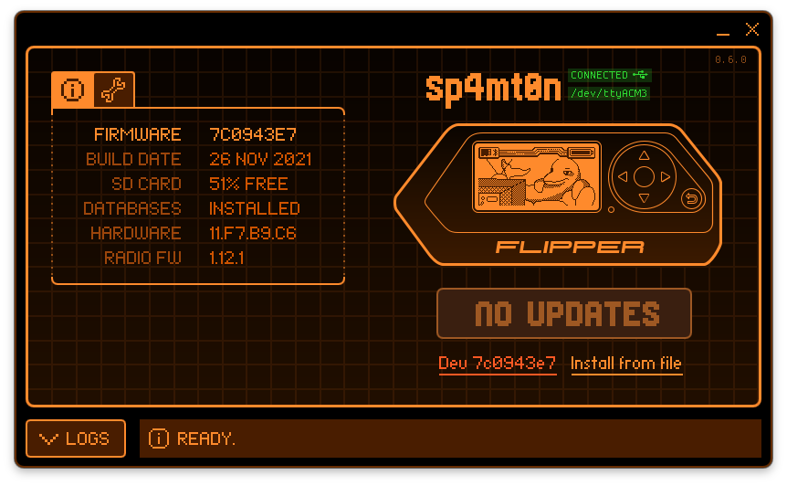

# qFlipper

Flipper companion application (desktop)

**WARNING!** This software is still a work in progress. Some features may be missing or not properly implemented, and the code might contain bugs or sub-optimal solutions.



## Build:
### Windows:

Build requirements:
- MS Visual Studio 2019 or newer
- Qt (MSVC build) >= 5.15.0
- Windows Driver Kit (to build libwdi)

Edit `build_windows.bat` to adjust to your build environment and then run:
```cmd
build_windows.bat
```

### Linux:

```sh
docker-compose exec dev ./build_linux.sh
```

If building qFlipper as a part of a native package, it is possible to disable the built-in application update feature by passing `DEFINES+=DISABLE_APPLICATION_UPDATES` to the `qmake` program.

### MacOS:

Build requirements:

- Xcode or command line tools
- Qt >= 5.15.0
- Libusb

If you want to sign binaries, set `SIGNING_KEY` environment variable:

	export SIGNING_KEY="Your Developer Key ID"

Building, signing and creating package:

	./build_mac.sh

Resulting image can be found in: `build_mac/qFlipper.dmg`

## Run:

### Linux:
```sh
./build/qFlipper-x86_64.AppImage
```

or just launch the file above from your favourite file manager.
You will likely need to set up udev rules in order to use qFlipper as a normal user. It can be done automatically by running [this script](setup_rules.sh):
```sh
chmod +x setup_rules.sh
./setup_rules.sh
```

## Known bugs:

* Sometimes Flipper's serial port doesn't get recognised by the OS, which leads to firmware update errors. This is a firmware issue.
* On some systems, there is noticeable flicker during opening, closing or resizing of the log area
